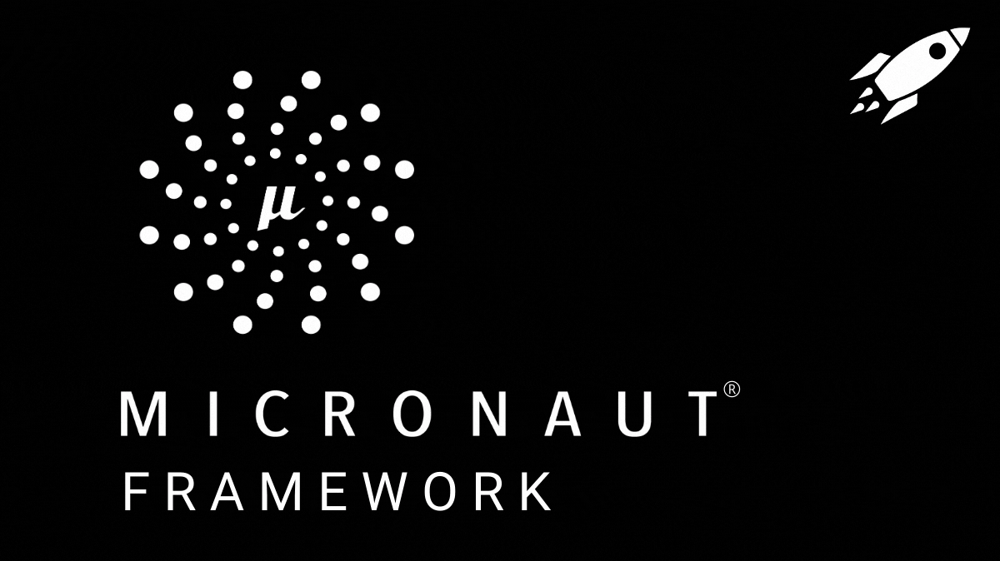

# Micronaut - Backend Framework for Java, Kotlin and Groovy

Here I will upload Micronaut courses, articles and documentation that I have used to learn it

- [Micronaut Official Documentation](https://docs.micronaut.io)

## 1. Oracle Offiial Course: Micronaut Fundamentals

Sergio del Amo Caballero (Principal Member of Technical Staff, Oracle)

- [Micronaut Fundamentals](https://mylearn.oracle.com/ou/course/micronaut-fundamentals/151938/)
- [Micronaut Fundamentals: Article](https://blogs.oracle.com/java/post/micronaut-fundamentals)

In this course we will learn the basics of Micronaut, a modern, JVM-based, full-stack framework for building modular, easily testable microservice and serverless applications. We will explore the core features of Micronaut, including dependency injection, AOP, configuration management, and more. By the end of this course, you will have a solid understanding of how to build and deploy applications using Micronaut.

### 1.1. Topics Covered

- Micronaut Documentation: How to find and read Micronaut documentation

- Creating our first Micronaut Application: How to create a simple Micronaut application

- IDE Integration: How to set up Micronaut in popular IDEs like IntelliJ IDEA and VS Code

- Exporing Micronaut Application: What are the main files and folders in a Micronaut application and how to run it

- Building Plugins: Official Maven and Gradle plugins for Micronaut

- Micronaut Core Concepts: Dependency Injection, AOP, Configuration Management, Bean Introspection and Bean Mapping

- Micronaut Testing: How to write and run tests in Micronaut applications with JUnit 5 and Micronaut Test plugin

- Serialization: How to serialize and deserialize objects in Micronaut applications using Jackson and JSON-B and review Micronaut Serialization module

- Application Events: How to create, listen and use application events in Micronaut applications. So we can publish and subscribe to events

- Dependency Injection: How to use dependency injection in Micronaut applications. We will learn about the different types of beans, scopes, and qualifiers

- Http Client and HTTP Server: How to create HTTP clients and servers in Micronaut applications. We will learn about the different types of HTTP clients, servers, and routes

- Filters: How to create and use filters in Micronaut applications. We will learn about the different types of filters, and how to apply them to routes and clients

- Management Endpoints: How to use management endpoints in Micronaut applications. We will learn about the different types of management endpoints

- Logging: We will use SL4J and Logback to log messages in Micronaut applications. We will learn about the different logging levels, appenders, and layouts

- Validations: How to use the Micronaut reflection-free Validation module to validate data and entries

- Error Formats and Exceptions: How to handle errors and exceptions in Micronaut applications. We will learn about the different types of errors, and how to customize error responses

- OpenAPI and Swagger: How to use OpenAPI and Swagger in Micronaut applications. We will learn about the different types of OpenAPI annotations, and how to generate Swagger documentation. Generate code from OpenAPI specifications with Micronaut plugins

- Distribution: How to package and distribute Micronaut applications. We will learn about the different types of packaging, and how to deploy applications to different environments

- GraalVM Native Image: How to create GraalVM native images from Micronaut applications. We will learn about the benefits of using GraalVM, and how to optimize applications for native image generation

- GDK: How to use the GraalVM Development Kit (GDK) for Micronaut applications. We will learn about the different GDK features, and how to use them to simplify code and improve performance
